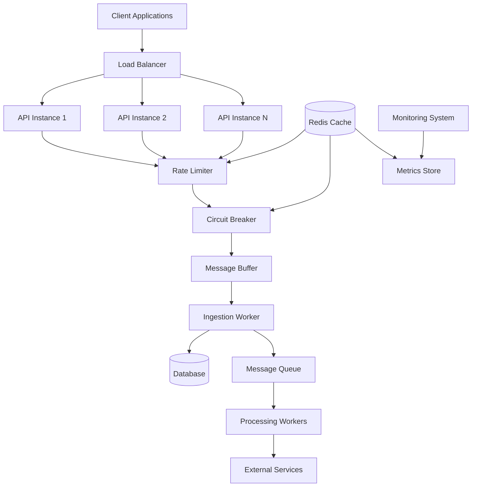

# Design Document: High-Throughput Messaging System

## Overview

This design document outlines the architecture for scaling the `SendOneWayMessageAsync` functionality to handle 10,000+ concurrent requests while maintaining system reliability, performance, and data consistency. The solution builds upon the existing ABP Framework architecture and introduces several new components for high-throughput message processing.

## Architecture

The high-throughput messaging system follows a multi-layered architecture with asynchronous processing pipelines:



## Components and Interfaces

### 1. Enhanced Message Buffer System

#### IAdvancedMessageBuffer
```csharp
public interface IAdvancedMessageBuffer
{
    Task<bool> TryWriteAsync(Message message, CancellationToken cancellationToken = default);
    Task<IReadOnlyList<Message>> ReadBatchAsync(int maxBatchSize, CancellationToken cancellationToken = default);
    Task<BufferStatus> GetStatusAsync();
    event EventHandler<BufferPressureEventArgs> BackpressureTriggered;
}

public class BufferStatus
{
    public int CurrentCount { get; set; }
    public int Capacity { get; set; }
    public double UtilizationPercentage { get; set; }
    public bool IsBackpressureActive { get; set; }
}
```

#### AdvancedMessageBuffer Implementation
```csharp
public class AdvancedMessageBuffer : IAdvancedMessageBuffer, ISingletonDependency
{
    private readonly Channel<Message> _channel;
    private readonly IConfiguration _configuration;
    private readonly ILogger<AdvancedMessageBuffer> _logger;
    private readonly SemaphoreSlim _backpressureSemaphore;
    
    public AdvancedMessageBuffer(IConfiguration configuration, ILogger<AdvancedMessageBuffer> logger)
    {
        var capacity = configuration.GetValue<int>("MessageBuffer:Capacity", 50000);
        var options = new BoundedChannelOptions(capacity)
        {
            FullMode = BoundedChannelFullMode.Wait,
            SingleReader = false,
            SingleWriter = false,
            AllowSynchronousContinuations = false
        };
        
        _channel = Channel.CreateBounded<Message>(options);
        _configuration = configuration;
        _logger = logger;
        _backpressureSemaphore = new SemaphoreSlim(1, 1);
    }
}
```

### 2. Rate Limiting System

#### IRateLimiter
```csharp
public interface IRateLimiter
{
    Task<RateLimitResult> CheckRateLimitAsync(string userId, string operation, CancellationToken cancellationToken = default);
    Task<UserRateLimits> GetUserLimitsAsync(string userId);
}

public class RateLimitResult
{
    public bool IsAllowed { get; set; }
    public TimeSpan RetryAfter { get; set; }
    public int RemainingRequests { get; set; }
    public DateTime WindowResetTime { get; set; }
}
```

#### DistributedRateLimiter Implementation
```csharp
public class DistributedRateLimiter : IRateLimiter, ITransientDependency
{
    private readonly IDistributedCache _cache;
    private readonly IUserPlanRepository _userPlanRepository;
    private readonly ILogger<DistributedRateLimiter> _logger;
    
    // Sliding window rate limiting using Redis sorted sets
    public async Task<RateLimitResult> CheckRateLimitAsync(string userId, string operation, CancellationToken cancellationToken = default)
    {
        var userLimits = await GetUserLimitsAsync(userId);
        var window = TimeSpan.FromMinutes(1); // 1-minute sliding window
        var key = $"rate_limit:{userId}:{operation}";
        
        // Implementation using Redis ZREMRANGEBYSCORE and ZCARD commands
        // for efficient sliding window rate limiting
    }
}
```

### 3. Circuit Breaker System

#### ICircuitBreaker
```csharp
public interface ICircuitBreaker
{
    Task<T> ExecuteAsync<T>(Func<Task<T>> operation, string operationName, CancellationToken cancellationToken = default);
    Task<CircuitBreakerState> GetStateAsync(string operationName);
    Task ResetAsync(string operationName);
}

public enum CircuitBreakerState
{
    Closed,
    Open,
    HalfOpen
}
```

#### DistributedCircuitBreaker Implementation
```csharp
public class DistributedCircuitBreaker : ICircuitBreaker, ISingletonDependency
{
    private readonly IDistributedCache _cache;
    private readonly ILogger<DistributedCircuitBreaker> _logger;
    private readonly CircuitBreakerOptions _options;
    
    // Polly-based circuit breaker with Redis state storage
    // for distributed circuit breaker functionality
}
```

### 4. Enhanced Message Processing Pipeline

#### IMessageProcessor
```csharp
public interface IMessageProcessor
{
    Task<ProcessingResult> ProcessAsync(Message message, CancellationToken cancellationToken = default);
    Task<BatchProcessingResult> ProcessBatchAsync(IReadOnlyList<Message> messages, CancellationToken cancellationToken = default);
}

public class ProcessingResult
{
    public bool IsSuccess { get; set; }
    public string? ErrorMessage { get; set; }
    public TimeSpan ProcessingTime { get; set; }
    public Dictionary<string, object> Metadata { get; set; } = new();
}
```

### 5. Performance Monitoring System

#### IPerformanceMonitor
```csharp
public interface IPerformanceMonitor
{
    void RecordRequestMetrics(string operation, TimeSpan duration, bool success);
    void RecordThroughputMetrics(string operation, int count);
    void RecordResourceMetrics(ResourceType type, double value);
    Task<SystemHealthStatus> GetHealthStatusAsync();
}

public class SystemHealthStatus
{
    public double RequestsPerSecond { get; set; }
    public double AverageResponseTime { get; set; }
    public double ErrorRate { get; set; }
    public double MemoryUtilization { get; set; }
    public double DatabaseConnectionUtilization { get; set; }
    public Dictionary<string, CircuitBreakerState> CircuitBreakerStates { get; set; } = new();
}
```

## Data Models

### Enhanced Message Processing Configuration

```csharp
public class HighThroughputOptions
{
    public MessageBufferOptions Buffer { get; set; } = new();
    public RateLimitingOptions RateLimiting { get; set; } = new();
    public CircuitBreakerOptions CircuitBreaker { get; set; } = new();
    public DatabaseOptions Database { get; set; } = new();
    public MonitoringOptions Monitoring { get; set; } = new();
}

public class MessageBufferOptions
{
    public int Capacity { get; set; } = 50000;
    public int BackpressureThreshold { get; set; } = 40000; // 80% of capacity
    public int BatchSize { get; set; } = 1000;
    public TimeSpan BatchTimeout { get; set; } = TimeSpan.FromMilliseconds(100);
}

public class RateLimitingOptions
{
    public Dictionary<string, UserTierLimits> TierLimits { get; set; } = new();
    public TimeSpan WindowSize { get; set; } = TimeSpan.FromMinutes(1);
    public bool EnableDistributedLimiting { get; set; } = true;
}

public class UserTierLimits
{
    public int RequestsPerMinute { get; set; }
    public int BurstLimit { get; set; }
    public int ConcurrentRequests { get; set; }
}
```

### Message Processing Metrics

```csharp
public class MessageProcessingMetrics
{
    public long TotalRequestsReceived { get; set; }
    public long TotalRequestsProcessed { get; set; }
    public long TotalRequestsFailed { get; set; }
    public double AverageProcessingTime { get; set; }
    public double RequestsPerSecond { get; set; }
    public int CurrentBufferSize { get; set; }
    public int ActiveConnections { get; set; }
    public Dictionary<string, long> ErrorCounts { get; set; } = new();
}
```

## Error Handling

### Comprehensive Error Handling Strategy

1. **Request Validation Errors**
   - Return HTTP 400 with detailed validation messages
   - Log validation failures for monitoring

2. **Rate Limiting Errors**
   - Return HTTP 429 with Retry-After header
   - Include remaining quota in response headers

3. **Buffer Overflow Errors**
   - Return HTTP 503 with backpressure indication
   - Implement exponential backoff for clients

4. **Database Errors**
   - Retry with exponential backoff
   - Circuit breaker protection for persistent failures
   - Graceful degradation to read-only mode if needed

5. **External Service Errors**
   - Circuit breaker protection
   - Message queuing for retry when services recover
   - Fallback to alternative providers if available

## Testing Strategy

### Unit Testing
- Test individual components (rate limiter, circuit breaker, buffer)
- Mock external dependencies
- Verify error handling and edge cases
- Test configuration validation

### Integration Testing
- Test component interactions
- Database connection pooling
- Redis integration
- Message flow through the pipeline

### Load Testing
- Simulate 10k+ concurrent requests
- Test backpressure mechanisms
- Verify graceful degradation
- Monitor resource utilization

### Property-Based Testing

*A property is a characteristic or behavior that should hold true across all valid executions of a system-essentially, a formal statement about what the system should do. Properties serve as the bridge between human-readable specifications and machine-verifiable correctness guarantees.*

Now I'll analyze the acceptance criteria to determine which can be tested as properties:

<function_calls>
<invoke name="prework">
<parameter name="featureName">high-throughput-messaging

## Correctness Properties

Based on the prework analysis, the following properties must hold for the high-throughput messaging system:

### Property 1: Concurrent Request Acceptance
*For any* set of up to 10,000 concurrent message requests, the system should accept all requests without timeout errors within reasonable time limits
**Validates: Requirements 1.1**

### Property 2: Backpressure Without Data Loss
*For any* load that exceeds system capacity, applying backpressure should not result in request data loss or corruption
**Validates: Requirements 1.2**

### Property 3: Response Time Under Load
*For any* concurrent load scenario, request acceptance response times should remain under 500ms
**Validates: Requirements 1.3**

### Property 4: Memory Flow Control
*For any* memory usage scenario approaching system limits, flow control mechanisms should activate before out-of-memory conditions occur
**Validates: Requirements 1.4**

### Property 5: Buffer Backpressure Threshold
*For any* buffer state at 80% capacity or higher, backpressure should be applied to incoming requests
**Validates: Requirements 2.2**

### Property 6: Full Buffer Handling
*For any* full buffer condition, the system should either queue requests or return appropriate HTTP 503 status codes without data loss
**Validates: Requirements 2.3**

### Property 7: Batch Processing Optimization
*For any* set of messages in the ingestion worker, messages should be processed in batches of optimal size for database throughput
**Validates: Requirements 2.4**

### Property 8: Graceful Shutdown Persistence
*For any* graceful shutdown scenario, all buffered messages should be persisted without loss
**Validates: Requirements 2.5**

### Property 9: Database Connection Exhaustion Handling
*For any* scenario where database connections are exhausted, operations should be queued rather than failed
**Validates: Requirements 3.2**

### Property 10: Exponential Backoff Retry
*For any* transient database failure, retry attempts should follow exponential backoff patterns
**Validates: Requirements 3.3**

### Property 11: Tier-Based Rate Limiting
*For any* user with a specific subscription tier, message sending limits should be enforced according to their plan
**Validates: Requirements 4.1**

### Property 12: Rate Limit Error Response
*For any* request that exceeds rate limits, the system should return HTTP 429 status with appropriate retry-after headers
**Validates: Requirements 4.2**

### Property 13: Sliding Window Rate Limiting
*For any* time window, rate limiting should implement sliding window behavior for smooth traffic distribution
**Validates: Requirements 4.4**

### Property 14: Circuit Breaker State Transition
*For any* sequence of external service failures exceeding the threshold, the circuit breaker should transition to open state
**Validates: Requirements 5.2**

### Property 15: Circuit Open Message Queuing
*For any* message sent when the circuit breaker is open, the message should be queued for retry when services recover
**Validates: Requirements 5.3**

### Property 16: Asynchronous Processing Separation
*For any* message request, request acceptance should complete immediately while validation and processing occur asynchronously
**Validates: Requirements 6.1**

### Property 17: Immediate Response with Tracking
*For any* message request received, the system should return immediately with a valid tracking ID
**Validates: Requirements 6.2**

### Property 18: Object Pooling Efficiency
*For any* frequently created object type (Message DTOs, validation objects), object pooling should be used to reduce allocations
**Validates: Requirements 7.1**

### Property 19: Memory-Efficient Batch Processing
*For any* large batch processing operation, the system should stream data rather than loading everything into memory
**Validates: Requirements 7.2**

### Property 20: Metrics Collection Accuracy
*For any* system operation, throughput monitoring should accurately track requests per second, response times, and error rates
**Validates: Requirements 8.1**

### Property 21: Priority Queue Ordering
*For any* set of messages with different priorities, high-priority messages should be processed before low-priority messages
**Validates: Requirements 9.3**

### Property 22: Runtime Configuration Updates
*For any* runtime configuration change for buffer sizes, rate limits, or timeouts, the new configuration should be applied without system restart
**Validates: Requirements 10.1**

## Implementation Phases

### Phase 1: Core Infrastructure (Weeks 1-2)
- Enhanced message buffer with backpressure
- Database connection pool optimization
- Basic performance monitoring

### Phase 2: Rate Limiting and Circuit Breaking (Weeks 3-4)
- Distributed rate limiting with Redis
- Circuit breaker implementation
- Integration with existing authentication

### Phase 3: Advanced Processing (Weeks 5-6)
- Asynchronous processing pipeline
- Object pooling and memory optimization
- Priority queue implementation

### Phase 4: Monitoring and Operations (Weeks 7-8)
- Comprehensive metrics and alerting
- Runtime configuration management
- Load testing and performance tuning

## Deployment Considerations

### Infrastructure Requirements
- **Redis Cluster**: For distributed rate limiting and circuit breaker state
- **Database Connection Scaling**: Increase connection pool sizes
- **Memory Allocation**: Minimum 8GB RAM per application instance
- **Load Balancer Configuration**: Session affinity not required
- **Monitoring Stack**: Prometheus + Grafana for metrics visualization

### Configuration Management
- Environment-specific configuration files
- Runtime configuration through ABP Settings
- Feature flags for gradual rollout
- Circuit breaker thresholds per environment

### Rollback Strategy
- Blue-green deployment for zero-downtime updates
- Database migration rollback procedures
- Configuration rollback capabilities
- Circuit breaker manual override controls

This design provides a comprehensive solution for scaling the `SendOneWayMessageAsync` functionality to handle 10k+ concurrent requests while maintaining system reliability and performance.